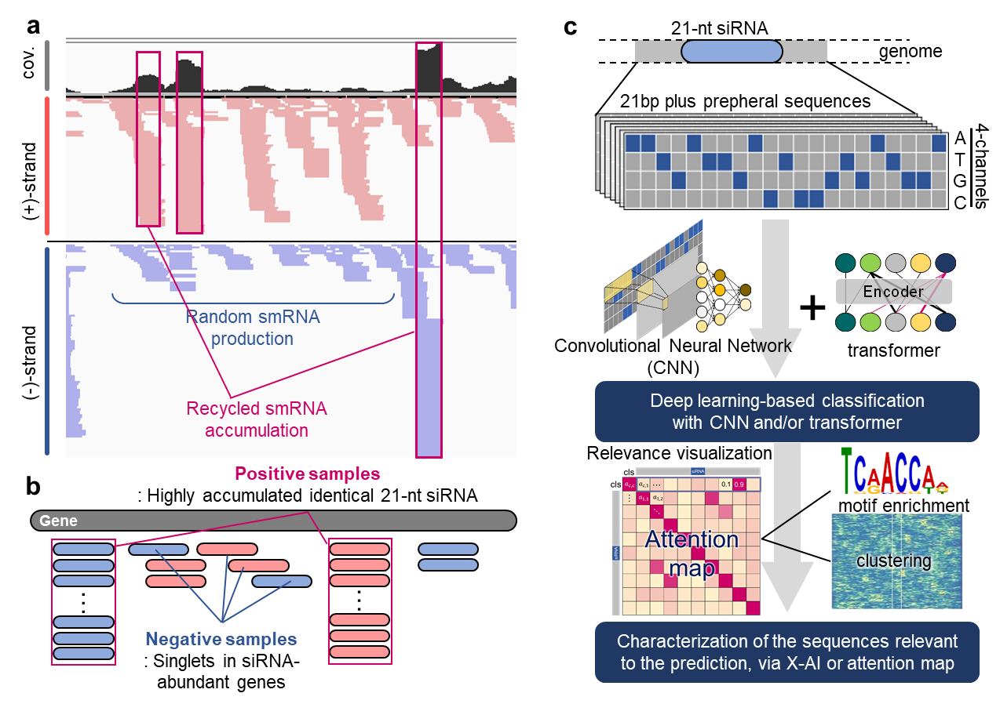

# Selective siRNA accumulation depends on interactions of flexible signal sequences and a novel RNA-binding factor in plants
Natsumi Enoki, Eriko Kuwada, Shinnosuke Matsuo, Naoko Fujita, Saki Noda, Yoshikatsu Matsubayashi, Seiichi Uchida, Takashi Akagi

<!--  -->
> abstact

## Usage
Please see [`USAGE`](USAGE.md) for brief instructions on installation and basic usage examples.

<!-- ## Citation
If you find this repository helpful, please consider citing:
```
@article{,
    author = {Natsumi Enoki and Eriko Kuwada and Shinnosuke Matsuo and Naoko Fujita and Saki Noda and Yoshikatsu Matsubayashi and Seiichi Uchida and Takashi Akagi},
    title = {Selective siRNA accumulation depends on interactions of flexible signal sequences and a novel RNA-binding factor in plants},
    journal = {},
    volume = {},
    number = {},
    pages = {},
    year = {2024},
    month = {},
} -->