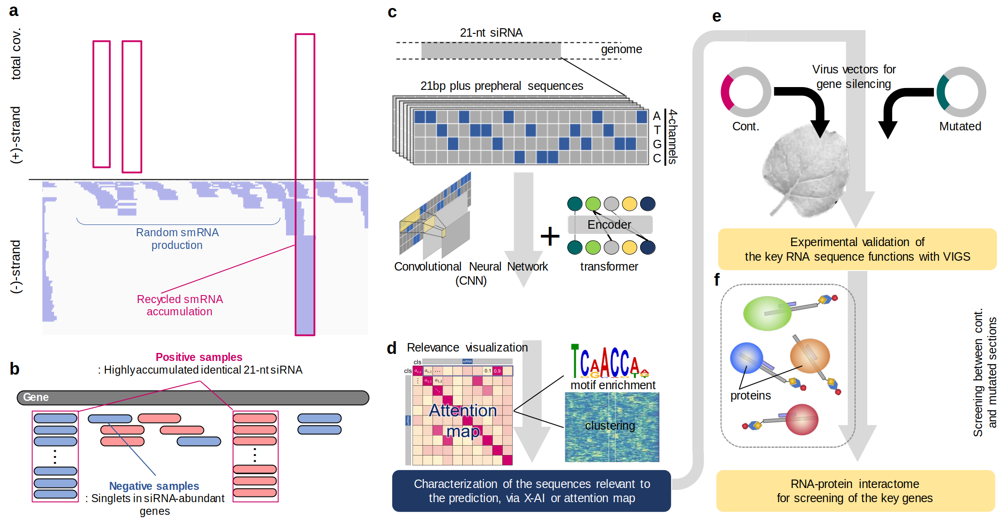

# Explainable deep learning-guided identification of a novel frame underlying selective small-RNA accumulation in plants
Natsumi Enoki, Eriko Kuwada, Shinnosuke Matsuo, Naoko Fujita, Saki Noda, Yoshikatsu Matsubayashi, Seiichi Uchida, Takashi Akagi

> Small interference RNA (siRNA) selectively accumulates and acts in RNA interference (RNAi). Although the components involved in siRNA production have long been the focus of studies to elucidate RNAi processes, the mechanism(s) for selectivity of siRNA (or RNAi effectivity) remains unclear. In a novel approach, we developed a progressive deep learning (DL) framework integrating Transformer and convolutional neural networks to predict the sequences of selectively accumulated siRNAs across various land plant species. These approaches achieved high-accuracy prediction of selectively accumulated 21-nt siRNAs and further identified their key signals, which are positionally and linguistically flexible sequences surrounding the target siRNA. We experimentally validated the contribution of these flexible key signal sequences to siRNA accumulation selectivity using virus-induced gene silencing (VIGS) in Nicotiana benthamiana, and identified RNA-binding proteins that directly recognize the key signal sequences to act for selective siRNA accumulation. These insights provide a novel framework for investigating RNAi mechanisms in plants.

Concept and experimental designs of this study.


## Usage
Please see [`USAGE`](USAGE.md) for brief instructions on installation and basic usage examples.

We also provide a [Google Colab notebook](https://colab.research.google.com/drive/1uGyBvI_9U5rMPh2kpadXPB0A6mnPqgSd?usp=sharing) that allows you to run this code very easily in your browser with minimal setup. Just click the link, open the notebook in Colab, and follow the instructions provided.

<!-- ## Citation
If you find this repository helpful, please consider citing:
```
@article{,
    author = {Natsumi Enoki and Eriko Kuwada and Shinnosuke Matsuo and Naoko Fujita and Saki Noda and Yoshikatsu Matsubayashi and Seiichi Uchida and Takashi Akagi},
    title = {Selective siRNA accumulation depends on interactions of flexible signal sequences and a novel RNA-binding factor in plants},
    journal = {},
    volume = {},
    number = {},
    pages = {},
    year = {2024},
    month = {},
} -->